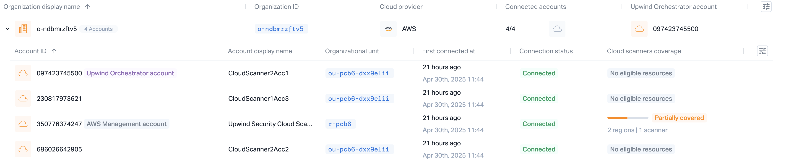

# Upwind AWS Organization Onboarding Terraform module
This module defines the IAM roles, policies and resources necessary to onboard the accounts of an AWS Organization
into to Upwind. Rather than attempting to deploy the resources into multiple accounts, the module has been defined
such that it can be readily integrated into IaC tools such as Terragrunt, which are much more capable of deploying 
the resources at scale across multiple accounts.
The structure of the terraform in this module is as follows:
* top level conditional logic which creates the resources based on account type.
* sub modules - one for each resource. These should be reasonably self contained units which could be run separately
  if desired.
## Organization Onboarding Process
The goal of the onboarding process is to connect all the necessary accounts within your AWS organization into Upwind, allowing 
Upwind to perform security audits and scans on those accounts as necessary.
The process can be initiated through the Upwind console which guides the user through the process, before applying 
this module to the accounts to create the necessary IAM roles and polices etc.
Once onboarded, it will be possible to inspect the accounts from inside the Upwind console.
 
## Account Types
Notionally the onboarding process takes 3 account types into consideration.
* Management account: An account with delegated permissions which should be used to manage the remaining accounts within the on: 
  Organization. In the context of the Upwind onboarding process, this account is used 
  to discover additional details about the AWS organization - eg the accounts.
* Orchestrator Account: The orchestrator account is regarded as a special account and is the account in which
  Upwind will orchestrator its scanning activities - creating the CloudScanner resources as necessary.
* Other accounts: The remaining accounts should be connected as these are accounts which are assumed to need protected
  whether through auditing or scanning.
## Roles and IAM Policies
The module defines a number of IAM roles and policies, some of which can be assumed from the upwind SaaS for the use cases 
described below.
### Trusted Entity
Any role that can be assume from Upwind has includes an trusted entity similar to the following example.
``` json
{
    "Version": "2012-10-17",
    "Statement": [
        {
            "Effect": "Allow",
            "Principal": {
                "AWS": "arn:aws:iam::340457201789:root"
            },
            "Action": "sts:AssumeRole",
            "Condition": {
                "StringEquals": {
                    "sts:ExternalId": "<<external-id>>"
                }
            }
        }
    ]
}
```
The external-id will be provided by Upwind as part of the onboarding processes.
### Organization Discovery role
The Organization discovery role is a read only role which can be assumed and is used to discover the accounts within
the AWS organization. It is assumed by Upwind to discover the accounts and account structure within the AWS organization.
The definition for the role can be found in the iam_organization_service_role submodule, and its creation is conditional so that the role is only created in
management account.
> [!TIP]
> The Organization Discovery role only needs to be created in the management account.
### Account Service role
The Account Service role, for the most part is a role that grants, and is assumed from Upwind for read only and audit access to the account, and which can be created
in all accounts. In the orchestrator account, if one is selected, the role contain elevated permissions which allows the it to used 
for the installation of CloudScanners.
This role is defined in the iam_account_service_role submodule.
> [!TIP]
> This Account Service role should be created in all accounts which are to be audited or scanned - which may optionally include the management account. If configuring 
> an orchestrator account the Account Service role must be created in the account with the elevated permissions.
### CloudScanner Administrator role
This role is only created in the orchestrator account - if one has been defined. It is the roll granted to the 
CloudScanner resources (Lambda's, ASG and EC2 instances) allowing them to function.
Note: Removing this role while it has attached resources (eg CloudScanners) should be avoided, as it is connected to these resources.
The definition for the role can be found in the iam_cloudscanner_admin_role.
> [!TIP]
> The CloudScanner admin role must be created in the orchestrator account if one has been selected.
### CloudScanner Execution role
This role grants the necessary permissions to allows the CloudScanner to perform cross account scans from the orchestrator account. Specifically,
the role can be assumed by the CloudScanner in the orchestrator account and can be used to create resources such as disk snapshots and fetch lambdas from accounts other 
than the orchestrator account.
The role is defined in the iam_cloudscanner_execution_role submodule.
> [!TIP]
> The CloudScanner Execution role should be installed in all accounts which are to be scanned. 

### Organization Discovery Role Registration
When being run in the management account, the module will attempt to register the Organization discovery role once the role has been created. This process makes an authenticated request to the 
Upwind SaaS passing the ARN of the Organization Discovery role, which in turn initiates the onboarding process within the Upwind backend end systems. This process firsts discovers the accounts 
in the organization, presenting them to the user within the Upwind Web console. From here the user can define additional scopes for the respective accounts etc.
The Upwind backend will continue to connect accounts as they are onboard, discovering resources, and if an orchestrator account has been configured, will install CloudScanners as scannable targets 
(eg VMs, lambdas etc.) are discovered.

> [!TIP]
> If its not possible to connect to the internet from you IAC system, this option can be disabled, but the Discovery role ARN will need to be provided to Upwind technical support in order to enter 
> into the system manually. This can be disabled as per the example below.
## CloudScanners
Shortly after the onboarding has completed, CloudScanners will be automatically installed into the orchestrator account, 
one per region which has scannable resources within all of the accounts.
Each CloudScanner includes a number of resources include AWS Lambdas and Auto Scaling groups which are used to scaler
a number of VM (workers) to perform the scans.
## Integration Guidelines
By default the module should contain all of the necessary logic such that it can be integrated into your IaC tool and apply
to all of the accounts within your AWS org. It should be possible to include the same variables/parameters into for each account, and doing this would be the preferred
method. However the module has been organized so that if required the resources can be separated out and more readily integrated into you IAC.
When doing so following guidelines should be followed.
### Resource Naming and Tags
By default the module provides default names for each of the resources - even allowing for small random suffix
to be appended to the end of each name. 
These names can be changed to align with your own naming conventions. However it is important that the same name for a given role function is used consistently
across all accounts and that the role names are set as defined in the submodules. The tags are used to help discover the role names and other resources created during on boarding.
When renaming a role - the name must be consistent in all accounts.
### Authentication Secrets
By default the module can either accept the secret clientId and secret value - or a secret ARN containing the generated 
values. If creating an ARN the values should be stored within the secret as follows:
```json
{
  "clientId": "<<client-id>>",
  "clientSecret": "<<client-secret>>"
}
```
You will need to ensure that the ARN is accessible across all regions, and if using non-default KMS keys to protect
the secret, that these are readily accessible - tailoring the roles if necessary.
### Custom Tags
Custom tags can be added to the module, and these will be applied to every resource created by the module - IAM roles and policies, and secrets.
## Examples
The following example of the module which can be applied to all accounts to create the roles as described above. This example defines the variable
install_roles_in_management_account which means the module will install the Account Service and CloudScanner Execution roles in the management account.
```hcl
provider "aws" {
   region = "us-east-1"
} 
   
module "upwind_aws_org_onboarding" {
   source = "https://get.upwind.io/terraform/modules/aws-org-onboarding/aws-org-onboarding-X.Y.Z.tar.gz"

   external_id                           = "F083B753-06B5-40B2-BE41-4035D6A7B6C7"
   
   upwind_org_register_auth_client_id    = "<<org-registrationation-client_id>>"
   upwind_org_register_auth_secret_value = "<<org-registrationation-client_secret>>"
   upwind_organization_id                = "org_abcdefrg" 
   
   orchestrator_account_id               = "123456789012"
   management_account_id                 = "098765432109"
   install_roles_in_management_account   = "true"

   role_name_suffix                      = "otmgax1m"

   upwind_cloudscanner_auth_client_id     = "<<cloudscanner-client-id>>"
   upwind_cloudscanner_auth_secret_value  = "<<cloudscanner-client-secret>>"
}

# Output the ARN of the organization discovery role
output "discovery_arn" {
  value = one(module.upwind_aws_org_onboarding.organization_discovery_role_arn[*])
}

output "org_registration_response_state" {
  description = "Org role registration response state"
  value       = one(module.upwind_aws_org_onboarding[*].org_registration_response_state)
}
```

The following example shows how to disable the org discovery role registration process. Given the addition variables including credentials are no longer needed,
they have also been removed from this example.
```hcl
provider "aws" {
   region = "us-east-1"
} 
   
module "upwind_aws_org_onboarding" {
   source = "https://get.upwind.io/terraform/modules/aws-org-onboarding/aws-org-onboarding-X.Y.Z.tar.gz"

   external_id                           = "F083B753-06B5-40B2-BE41-4035D6A7B6C7"

   # Disable Org Discovery role registration
   upwind_disable_org_discovery_role_registration  = true
   
   orchestrator_account_id               = "123456789012"
   management_account_id                 = "098765432109"
   install_roles_in_management_account   = "true"

   role_name_suffix                      = "otmgax1m"

   upwind_cloudscanner_auth_client_id     = "<<cloudscanner-client-id>>"
   upwind_cloudscanner_auth_secret_value  = "<<cloudscanner-client-secret>>"
}

# Output the ARN of the organization discovery role
output "discovery_arn" {
  value = one(module.upwind_aws_org_onboarding.organization_discovery_role_arn[*])
}

output "org_registration_response_state" {
  description = "Org role registration response state"
  value       = one(module.upwind_aws_org_onboarding[*].org_registration_response_state)
}
```

The following example is comparable to the first, but shows how to inject the alternative role names into the module. This would be the preferred method for changing roles
as should ensure continuity across all accounts, although it is recommended to choose more appropriate values that those in this example. The example also illustrates on
custom tags can be applied to the module:
```hcl
provider "aws" {
  region = "us-east-1"
} 
   
module "upwind_aws_org_onboarding" {
  source = "https://get.upwind.io/terraform/modules/aws-org-onboarding/aws-org-onboarding-X.Y.Z.tar.gz"

  external_id                           = "F083B753-06B5-40B2-BE41-4035D6A7B6C7"
  
  upwind_org_register_auth_client_id    = "<<org-registrationation-client_id>>"
  upwind_org_register_auth_secret_value = "<<org-registrationation-client_secret>>"
  upwind_organization_id                = "org_abcdefrg" 
  
  orchestrator_account_id               = "123456789012"
  management_account_id                 = "098765432109"
  install_roles_in_management_account   = "true"

  role_name_suffix                      = "otmgax1m"

  upwind_cloudscanner_auth_client_id     = "<<cloudscanner-client-id>>"
  upwind_cloudscanner_auth_secret_value  = "<<cloudscanner-client-secret>>"


  organization_role_name                 = "Alt-role-name-1"
  account_service_role_name              = "Alt-role-name-2"
  cloudscanner_administration_role_name  = "Alt-role-name-3"
  cloudscanner_execution_role_name       = "Alt-role-name-4"

  // Define some custom tags to be applied to the resources created by the module.
  custom_tags = {
    TagKey1 = "TagValue1",
    TagKey2 = "TagValue2"
   }

}

# Output the ARN of the organization discovery role
output "discovery_arn" {
  value = one(module.upwind_aws_org_onboarding.organization_discovery_role_arn[*])
}

output "org_registration_response_state" {
  description = "Org role registration response state"
  value       = one(module.upwind_aws_org_onboarding[*].org_registration_response_state)
}
```

## Providers

| Name | Version |
|------|---------|
| <a name="provider_aws"></a> [aws](#provider\_aws) | 5.99.1 |
| <a name="provider_null"></a> [null](#provider\_null) | 3.2.4 |
| <a name="provider_time"></a> [time](#provider\_time) | 0.13.1 |
## Outputs

| Name | Description |
|------|-------------|
| <a name="output_account_service_role_arn"></a> [account\_service\_role\_arn](#output\_account\_service\_role\_arn) | The ARN of the IAM role created for security auditing purposes. |
| <a name="output_account_service_role_name"></a> [account\_service\_role\_name](#output\_account\_service\_role\_name) | The Name of the IAM role created for security auditing purposes. |
| <a name="output_cloudscanner_admin_role_arn"></a> [cloudscanner\_admin\_role\_arn](#output\_cloudscanner\_admin\_role\_arn) | The ARN of the CloudScanner admin IAM role created for managing cloud scanning operations. |
| <a name="output_cloudscanner_admin_role_name"></a> [cloudscanner\_admin\_role\_name](#output\_cloudscanner\_admin\_role\_name) | The Name of the CloudScanner admin IAM role created for managing cloud scanning operations. |
| <a name="output_cloudscanner_execution_role_arn"></a> [cloudscanner\_execution\_role\_arn](#output\_cloudscanner\_execution\_role\_arn) | The ARN of the CloudScanner execution IAM role created for performing cloud scanning operations. |
| <a name="output_cloudscanner_execution_role_name"></a> [cloudscanner\_execution\_role\_name](#output\_cloudscanner\_execution\_role\_name) | The Name of the CloudScanner execution IAM role created for performing cloud scanning operations. |
| <a name="output_cloudscanner_secret_arn"></a> [cloudscanner\_secret\_arn](#output\_cloudscanner\_secret\_arn) | The ARN of the CloudScanner Credentials secret. |
| <a name="output_cloudscanner_secret_name"></a> [cloudscanner\_secret\_name](#output\_cloudscanner\_secret\_name) | The name of the CloudScanner Credentials secret. |
| <a name="output_org_registration_response"></a> [org\_registration\_response](#output\_org\_registration\_response) | Org role registration response |
| <a name="output_org_registration_response_state"></a> [org\_registration\_response\_state](#output\_org\_registration\_response\_state) | Org role registration response state |
| <a name="output_organization_discovery_role_arn"></a> [organization\_discovery\_role\_arn](#output\_organization\_discovery\_role\_arn) | The ARN of the IAM role created for account discovery purposes. This ARN should be entered in to the Upwind Console |
| <a name="output_organization_discovery_role_name"></a> [organization\_discovery\_role\_name](#output\_organization\_discovery\_role\_name) | The Name of the IAM role created for account discovery purposes. |
| <a name="output_upwind_release_version"></a> [upwind\_release\_version](#output\_upwind\_release\_version) | The release version tag assigned to the deployment. For version visibility. |
## Inputs

| Name | Description | Type | Default | Required |
|------|-------------|------|---------|:--------:|
| <a name="input_account_service_cloudformation_policy_name"></a> [account\_service\_cloudformation\_policy\_name](#input\_account\_service\_cloudformation\_policy\_name) | The base name to be used for the Cloudformation policy name in the account service role. | `string` | `"UpwindAccountServiceCloudFormationPolicy"` | no |
| <a name="input_account_service_cloudscanner_ec2_network_policy_name"></a> [account\_service\_cloudscanner\_ec2\_network\_policy\_name](#input\_account\_service\_cloudscanner\_ec2\_network\_policy\_name) | The base name to be used when creating the CloudScanner EC2 Network Policy for the Account Service role.<br>This policy contains permissions to create and manage EC2 network resources which can be omitted if you<br>intend to provide the network stack configuration. | `string` | `"UpwindAccountServiceCloudScannerEC2NetworkPolicy"` | no |
| <a name="input_account_service_cloudscanner_ec2_policy_name"></a> [account\_service\_cloudscanner\_ec2\_policy\_name](#input\_account\_service\_cloudscanner\_ec2\_policy\_name) | The base name to be used for the CloudScanner EC2 policy name in the account service role. | `string` | `"UpwindAccountServiceCloudScannerEC2Policy"` | no |
| <a name="input_account_service_cloudscanner_policy_name"></a> [account\_service\_cloudscanner\_policy\_name](#input\_account\_service\_cloudscanner\_policy\_name) | The base name to be used for the CloudScanner policy name in the account service role. | `string` | `"UpwindAccountServiceCloudScannerPolicy"` | no |
| <a name="input_account_service_role_name"></a> [account\_service\_role\_name](#input\_account\_service\_role\_name) | The base name of the IAM role to be created, used for security auditing purposes. | `string` | `"UpwindAccountServiceRole"` | no |
| <a name="input_aws_iam_role_creation_wait_time"></a> [aws\_iam\_role\_creation\_wait\_time](#input\_aws\_iam\_role\_creation\_wait\_time) | The duration of time to wait for the completion of the IAM role creation. | `string` | `"20s"` | no |
| <a name="input_cloudscanner_administration_role_name"></a> [cloudscanner\_administration\_role\_name](#input\_cloudscanner\_administration\_role\_name) | The base name of the IAM administration role to be created, used for cloud scanning operations. | `string` | `"UpwindCloudScannerAdministrationRole"` | no |
| <a name="input_cloudscanner_execution_role_name"></a> [cloudscanner\_execution\_role\_name](#input\_cloudscanner\_execution\_role\_name) | The base name of the IAM execution role to be created, used for cloud scanning operations. | `string` | `"UpwindCloudScannerExecutionRole"` | no |
| <a name="input_cloudscanner_secret_name"></a> [cloudscanner\_secret\_name](#input\_cloudscanner\_secret\_name) | The base name used when creating the CloudScanner credentials secret. | `string` | `"/cloudscanner-credentials"` | no |
| <a name="input_credentials_secret_name_prefix"></a> [credentials\_secret\_name\_prefix](#input\_credentials\_secret\_name\_prefix) | The prefix for the AWS Secrets Manager secret name storing Upwind client credentials. Used to create the secret if `UpwindClientId` and `UpwindClientSecret` are provided. | `string` | `"/upwind"` | no |
| <a name="input_custom_tags"></a> [custom\_tags](#input\_custom\_tags) | Custom tags which shall be applied to each resource created by the module. | `map(string)` | `{}` | no |
| <a name="input_external_id"></a> [external\_id](#input\_external\_id) | The external ID for secure cross-account role assumption. | `string` | n/a | yes |
| <a name="input_install_roles_in_management_account"></a> [install\_roles\_in\_management\_account](#input\_install\_roles\_in\_management\_account) | Install the additional roles in the management account - if required. | `bool` | `false` | no |
| <a name="input_management_account_id"></a> [management\_account\_id](#input\_management\_account\_id) | The account ID of the AWS Organization management account. The Org discover role will be created in this account. | `string` | n/a | yes |
| <a name="input_orchestrator_account_id"></a> [orchestrator\_account\_id](#input\_orchestrator\_account\_id) | The account ID of the Upwind orchestrator account. If specified, certain roles will only be created in this account to maintain operational security and control. | `string` | `null` | no |
| <a name="input_organization_role_name"></a> [organization\_role\_name](#input\_organization\_role\_name) | The base name of the IAM role to be created, used for account discovery within the AWS Org. | `string` | `"UpwindOrganizationServiceRole"` | no |
| <a name="input_role_name_suffix"></a> [role\_name\_suffix](#input\_role\_name\_suffix) | A user specific suffix that will be appended to resources - eg role names. | `string` | `null` | no |
| <a name="input_upwind_auth_endpoint"></a> [upwind\_auth\_endpoint](#input\_upwind\_auth\_endpoint) | The Authentication API endpoint. | `string` | `"https://auth.upwind.io"` | no |
| <a name="input_upwind_cloudscanner_auth_client_id"></a> [upwind\_cloudscanner\_auth\_client\_id](#input\_upwind\_cloudscanner\_auth\_client\_id) | The CloudScanner client ID for Upwind Security authentication. | `string` | `null` | no |
| <a name="input_upwind_cloudscanner_auth_secret_arn"></a> [upwind\_cloudscanner\_auth\_secret\_arn](#input\_upwind\_cloudscanner\_auth\_secret\_arn) | The ARN of the secret containing the CloudScanner credentials. | `string` | `null` | no |
| <a name="input_upwind_cloudscanner_auth_secret_value"></a> [upwind\_cloudscanner\_auth\_secret\_value](#input\_upwind\_cloudscanner\_auth\_secret\_value) | The CloudScanner client secret for Upwind Security authentication. | `string` | `null` | no |
| <a name="input_upwind_cloudscanner_management_enabled"></a> [upwind\_cloudscanner\_management\_enabled](#input\_upwind\_cloudscanner\_management\_enabled) | Enable the permissions necessary to support automated CloudScanner deployment and management. | `bool` | `true` | no |
| <a name="input_upwind_disable_org_discovery_role_registration"></a> [upwind\_disable\_org\_discovery\_role\_registration](#input\_upwind\_disable\_org\_discovery\_role\_registration) | Disable the Org discovery role registration process. | `bool` | `false` | no |
| <a name="input_upwind_feature_dspm_account_whitelist"></a> [upwind\_feature\_dspm\_account\_whitelist](#input\_upwind\_feature\_dspm\_account\_whitelist) | (Optional). If set, and given upwind\_feature\_dspm\_enabled is true, this will limit the accounts that we create the DSPM S3 permissions in | `list(string)` | `[]` | no |
| <a name="input_upwind_feature_dspm_enabled"></a> [upwind\_feature\_dspm\_enabled](#input\_upwind\_feature\_dspm\_enabled) | Enable the creation of roles to enable DSPM scanning. This includes permissions to access the the contents of S3 buckets. | `bool` | `true` | no |
| <a name="input_upwind_include_ec2_network_management_permissions"></a> [upwind\_include\_ec2\_network\_management\_permissions](#input\_upwind\_include\_ec2\_network\_management\_permissions) | Include permissions necessary to create and manage EC2 network resources. | `bool` | `true` | no |
| <a name="input_upwind_integration_endpoint"></a> [upwind\_integration\_endpoint](#input\_upwind\_integration\_endpoint) | The Integration API endpoint. | `string` | `"https://integration.upwind.io"` | no |
| <a name="input_upwind_org_register_auth_client_id"></a> [upwind\_org\_register\_auth\_client\_id](#input\_upwind\_org\_register\_auth\_client\_id) | The client ID used for authentication with the Upwind Authorization Service. | `string` | `null` | no |
| <a name="input_upwind_org_register_auth_secret_arn"></a> [upwind\_org\_register\_auth\_secret\_arn](#input\_upwind\_org\_register\_auth\_secret\_arn) | The ARN of a secret containing the org registration secret. | `string` | `null` | no |
| <a name="input_upwind_org_register_auth_secret_value"></a> [upwind\_org\_register\_auth\_secret\_value](#input\_upwind\_org\_register\_auth\_secret\_value) | The client secret for authentication with the Upwind Authorization Service. | `string` | `null` | no |
| <a name="input_upwind_organization_id"></a> [upwind\_organization\_id](#input\_upwind\_organization\_id) | The identifier of the Upwind organization to integrate with. | `string` | `null` | no |
| <a name="input_upwind_region"></a> [upwind\_region](#input\_upwind\_region) | Which Upwind region to communicate with. 'us', 'eu' or 'me' | `string` | `"us"` | no |
| <a name="input_upwind_trusted_account_id"></a> [upwind\_trusted\_account\_id](#input\_upwind\_trusted\_account\_id) | The identifier of the trusted account used for IAM cross-account access. | `string` | `"340457201789"` | no |
## Resources

| Name | Type |
|------|------|
| [null_resource.validate_management_account](https://registry.terraform.io/providers/hashicorp/null/latest/docs/resources/resource) | resource |
| [time_sleep.wait_for_org_discovery_role_creation](https://registry.terraform.io/providers/hashicorp/time/latest/docs/resources/sleep) | resource |
| [aws_caller_identity.current](https://registry.terraform.io/providers/hashicorp/aws/latest/docs/data-sources/caller_identity) | data source |
